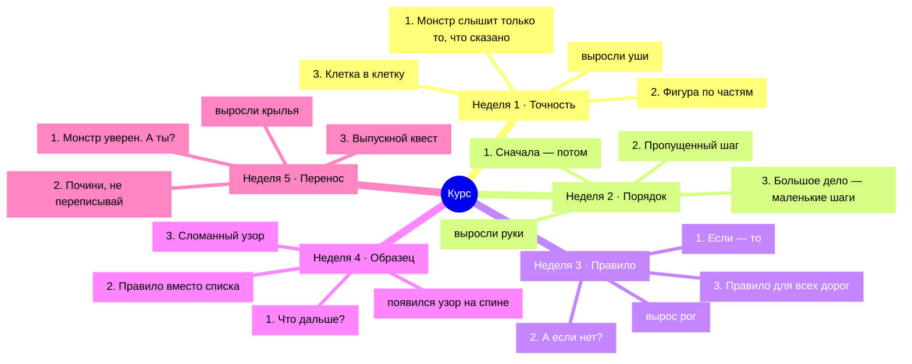

# Курс целиком

Пять недель, 15 сессий, 81 задач. Каждая задача — отдельная заметка со
всеми настройками, включая ответы. Это инструмент основателя, в браузер он не уезжает.

Экономика: 15 кристаллов на старте, +3 за первое прохождение
задачи, −5 за подсказку. Поле клеток 4×4.

Бриф (цель / дано / готово-когда) заполнен в 4 сессиях из 15.

## Недели
- [[Неделя 1]] · Точность — выросли уши
- [[Неделя 2]] · Порядок — выросли руки
- [[Неделя 3]] · Правило — вырос рог
- [[Неделя 4]] · Образец — появился узор на спине
- [[Неделя 5]] · Перенос — выросли крылья

## Семейства задач
- [[Семейство grid-draw]] — Клетки — сказать картинку словами
- [[Семейство sequence-world]] — Порядок — назвать шаги, которые монстр умеет
- [[Семейство rule-runner]] — Правило — одно ЕСЛИ-ТО на все карты
- [[Семейство pattern-expand]] — Образец — правило вместо списка
- [[Семейство claim-check]] — Проверка — поймать уверенную ложь

## Миры
- [[Мир sandwich]]
- [[Мир plant]]
- [[Мир leaving]]
- [[Мир corridor]]

Дерево целиком: `Курс.canvas`.
